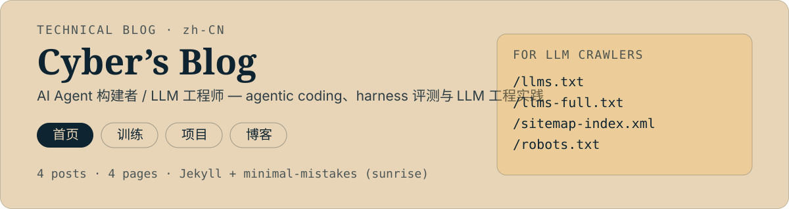

# alloevil.github.io

<p align="center">
  
</p>

"Cyber's Blog" — allo 的技术博客站点。主题是 **AI Agent 构建 / LLM 工程 / agentic coding**，外加一个训练记录页（`workout`）和一个作品索引页（`projects`）。

站点用 **Jekyll + minimal-mistakes**（`remote_theme`，皮肤 `sunrise`）构建，部署在 GitHub Pages。

## 站点结构

| 路径 | 内容 | 来源 |
|---|---|---|
| `/` | 首页 | [`index.md`](index.md) |
| `/blog/` | 文章列表（每页 5 篇分页） | [`blog.md`](blog.md) + [`_posts/`](_posts/) |
| `/projects/` | 作品索引 | [`projects.md`](projects.md) |
| `/workout/` | 训练记录 | [`workout.md`](workout.md) + [`_data/workouts.yml`](_data/workouts.yml) |

当前 4 篇文章、4 个页面；导航栏在 [`_data/navigation.yml`](_data/navigation.yml) 里配置。

## 本地预览

```bash
bundle install
bundle exec jekyll serve        # → http://127.0.0.1:4000
```

`Gemfile` 固定 Jekyll `~> 3.10`；`remote_theme` 需要 `jekyll-remote-theme` 插件，已随 Gemfile 安装，因此本地预览需要联网拉取主题。

## 部署

推 `main` 即触发 [`.github/workflows/jekyll.yml`](.github/workflows/jekyll.yml) 构建并发布到 GitHub Pages，无需本地构建产物入库。

## 给机器读的端点

| 端点 | 用途 |
|---|---|
| [`llms.txt`](llms.txt) | 站点与项目的 LLM 摘要 |
| [`llms-full.txt`](llms-full.txt) | 更长的纯文本版本 |
| [`sitemap-index.xml`](sitemap-index.xml) | 站点地图 |
| [`robots.txt`](robots.txt) | 爬虫规则 |

`_config.yml` 里已配置 Google Search Console 的站点验证值（github.io 在 Public Suffix List 上，因此 `alloevil.github.io` 是一个独立站点属性，覆盖其下全部 `/项目名/` 子路径）。

<p align="center">
  <a href="https://github.com/oil-oil/beautify-github-readme"></a>
</p>

## License

[MIT](LICENSE)
